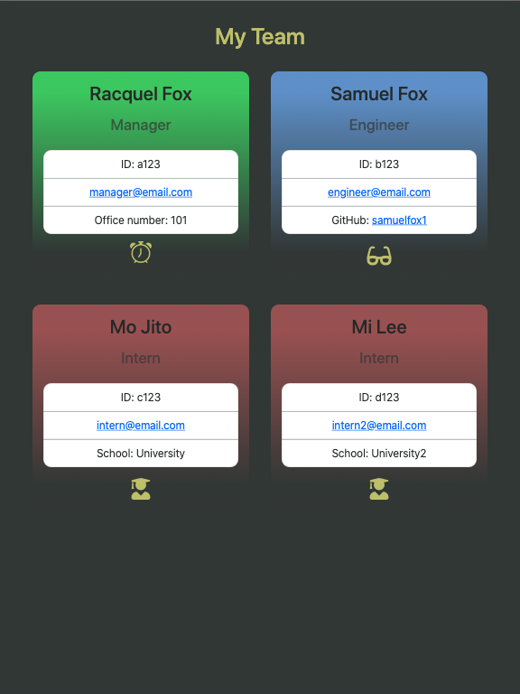

# team-profile-generator

>## Description 

* Easily build a professional contact sheet for all of your employees
* #### Story
    * AS A: team manager
    * I WANT: a quality webpage to keep track of team members and basic information about them
    * SO THAT: I can easily find information when needed

 

>## Table of Contents

* [Contributing](#Contributing)
* [Description](#Description)
* [Installation](#Installation)
* [License](#License)
* [Questions](#Questions)
* [Story](#Story)
* [Testing](#Testing)
* [Usage](#Usage)
 

 

 

>## Product

* [Check it out!](https://samuelfox1.github.io/team-profile-generator/) 

 

>## Installation

1. Install node.js on your computer.
2. Download this project folder
3. Navigate to project folder in Terminal.
4. Run npm i to install the dependencies.
5. Finished.

 

>## Usage

1. Run node app.js to launch the application.
2. Start with entering manager information.
3. At the home page, select 'Add employee'.
4. Add employee information, repeat until all employees have been entered.
5. If you'd like to see which employees have been entered, select 'View added employees'

 

>## Contributing

* [Submit bugs and feature requests](https://github.com/samuelfox1/team-profile-generator/issues)
* [Review changes](https://github.com/samuelfox1/team-profile-generator/pulls)
* [Contributor Covenant Code of Conduct](./assets/utils/CodeOfConduct.md)

 

>## Testing

* In terminal, after running npm i to install dependencies, you may run 'npm run test' to review code tests

 

>## Questions

| Name | Email  | Github  | LinkedIn |
| :--: | :----: | :-----: | :------: |
| Samuel Fox | samueljasonfox@gmail.com |  |  |

 

>## License

MIT License

Copyright 2021 Samuel Fox

Permission is hereby granted, free of charge, to any person obtaining a copy of this software and associated documentation files (the "Software"), to deal in the Software without restriction, including without limitation the rights to use, copy, modify, merge, publish, distribute, sublicense, and/or sell copies of the Software, and to permit persons to whom the Software is furnished to do so, subject to the following conditions:

The above copyright notice and this permission notice shall be included in all copies or substantial portions of the Software.

THE SOFTWARE IS PROVIDED "AS IS", WITHOUT WARRANTY OF ANY KIND, EXPRESS OR IMPLIED, INCLUDING BUT NOT LIMITED TO THE WARRANTIES OF MERCHANTABILITY, FITNESS FOR A PARTICULAR PURPOSE AND NONINFRINGEMENT. IN NO EVENT SHALL THE AUTHORS OR COPYRIGHT HOLDERS BE LIABLE FOR ANY CLAIM, DAMAGES OR OTHER LIABILITY, WHETHER IN AN ACTION OF CONTRACT, TORT OR OTHERWISE, ARISING FROM, OUT OF OR IN CONNECTION WITH THE SOFTWARE OR THE USE OR OTHER DEALINGS IN THE SOFTWARE.

 

The 'assets/images/logo/' are trademarks of their respective companies and are under their terms and license.
 

2021
 

>## [Top of page](#team-profile-generator)
